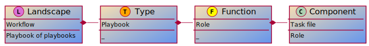

= Automation structures

Before we start to describe roles, playbooks, etc, we need to decide which one we use for what.
This section is meant for topics which span across multiple structures and don't fit nicely within one.

== Define which structure to use for which purpose
[%collapsible]
====
Explanations::
define for which use case to use roles, playbooks, potentially workflows (in Ansible Tower/AWX), and how to split the code you write.

Rationale::
especially when writing automation in a team, it is important to have a certain level of consistence and make sure everybody has the same understanding.
By lack of doing so, your automation becomes unreadable and difficult to grasp for new members or even for existing members.
+
This structure will also help you to have a consistent level of modelization so that re-usability becomes easier.
If one team member uses roles where another one uses playbooks, they will both struggle to reuse the code of each other.
Metaphorically speaking, only if stones have been cut at roughly the same size, can they be properly used to build a house.

Examples::
The following is only one example of how to structure your content but has proven robust enough on multiple occasions.
+
.Structure of Automation

+
* a _landscape_ is anything you want to deploy at once, the underlay of your cloud, a three tiers application, a complete application cluster...
  This level is represented at best by a Tower/AWX workflow, potentially by a "playbook of playbooks", i.e. a playbook made of imported _type_ playbooks, as introduced next.
* a _type_ must be defined such that each managed host has one and only one type, applicable using a unique playbook.
* each type is then made of multiple _functions_, represented by roles, so that the same function used by the same _type_ can be re-used, written only once.
* and finally _components_ are used to split a _function_ in maintainable bits. By default a component is a task file within the _function_-role, if the role becomes too big, there is a case for splitting the _function_ role into multiple _component_ roles.
+
NOTE: if _functions_ are defined mostly for re-usability purposes, _components_ are more used for maintainability / readability purposes. A re-usable component might be a candidate for promotion to a function.
+
Let's have a more concrete example to clarify:
+
* as already written, a _landscape_ could be a three tier application with web-front-end, middleware and database.
  We would probably create a workflow to deploy this landscape at once.
* our types would be relatively obvious here as we would have "web-front-end server", "middleware server" and "database server".
  Each type can be fully deployed by one and only one playbook (avoid having numbered playbooks and instructions on how to call them one after the other).
* each server type is then made up of one or more _functions_, each implemented as a role.
  For example, the middleware server type could be made of a "virtual machine" (to create the virtual machine hosting the middleware server), a "base Linux OS" and a "JBoss application server" function.
* and then the base OS role could be made of multiple components (DNS, NTP, SSH, etc), each represented by a separate `tasks/{component}.yml` file, included or imported from the `tasks/main.yml` file of the _function_-role.
  If a component becomes too big to fit within one task file, it might make sense that it gets its own component-role, included from the function-role.
+
NOTE: in terms of re-usability, see how you could simply create a new "integrated three tiers server" type (e.g. for test purposes), by just re-combining the "virtual machine", "base Linux OS", "JBoss application server", "PostgreSQL database" and "Apache web-server" function-roles into one new playbook.

Beware that those rules, once defined, shouldn't be applied too strictly.
There can always be reasons for breaking the rules, and sometimes the discussion you can have in the team to decide what is what is more important.
For example if a "hardened Linux OS" and a "normal Linux OS" are two different functions, or the same function with different parameters. You could consider SSH to be a function on its own and not a component of the base OS.
Also, external re-usable roles and collections, obviously not respecting your rules, might force you to bend them.
Important is to break the rules not by ignorance of those but because of good and practical reasons.
Respecting the rules is to know and acknowledge them, not to follow them blindly even if they don't make sense.
As long as exceptions are discussed openly in the team, they won't hurt.
====
